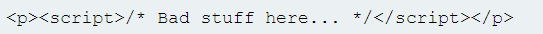

# Authentication vulnerabilities

Уязвимости аутентификации являются одними из самых простых проблем для понимания, однако они могут быть одними из самых важных из-за очевидной связи между аутентификацией и безопасностью. Помимо потенциального предоставления злоумышленникам прямого доступа к конфиденциальным данным и функциональным возможностям, они также открывают дополнительную поверхность атаки для дальнейших эксплойтов.&#x20;

По этой причине изучение способов выявления и использования уязвимостей аутентификации, в том числе способов обхода общих мер защиты, является фундаментальным навыком.

Аутентификация — это процесс проверки личности данного пользователя или клиента. Существует три фактора аутентификации, на которые можно разделить различные типы аутентификации:

* Что-то, что вы знаете, например пароль или ответ на контрольный вопрос, их иногда называют «факторами знаний»
* Что-то, что у вас есть, то есть физический объект, например мобильный телефон или security token, их иногда называют «факторами владения»
* Что-то, чем вы являетесь или что делаете, например, ваши биометрические данные или модели поведения, их иногда называют «факторами неотъемлемости»

Механизмы аутентификации основаны на ряде технологий для проверки одного или нескольких из этих факторов.

Аутентификация — это процесс проверки того, что пользователь действительно является тем, за кого себя выдает, тогда как авторизация включает проверку того, разрешено ли пользователю что-то делать.

Вообще говоря, большинство уязвимостей в механизмах аутентификации возникают одним из двух способов:

* Механизмы аутентификации слабы, потому что они не могут адекватно защитить от атак грубой силы
* Логические недостатки или плохой код в реализации позволяют злоумышленнику полностью обойти механизмы аутентификации

Воздействие уязвимостей аутентификации может быть очень серьезным. После того как злоумышленник либо обошел аутентификацию, либо взломал учетную запись другого пользователя, он получает доступ ко всем данным и функциям, которыми обладает взломанная учетная запись.

Система аутентификации веб-сайта обычно состоит из нескольких отдельных механизмов, в которых могут возникать уязвимости, некоторые уязвимости широко применимы во всех этих контекстах, в то время как другие более специфичны для предоставляемой функциональности.

Одни из наиболее распространенных уязвимостей в следующих областях:

* Уязвимости входа по паролю
* Уязвимости в многофакторной аутентификации
* Уязвимости в многофакторной аутентификации

### Уязвимости входа по паролю

*   ### Brute-force attacks (Атаки грубой силы) 

    Атака грубой силы — это когда злоумышленник использует систему проб и ошибок, пытаясь угадать действительные учетные данные пользователя. Эти атаки обычно автоматизируются с использованием списков имен пользователей и паролей. Автоматизация этого процесса, особенно с использованием специальных инструментов, потенциально позволяет злоумышленнику совершать огромное количество попыток входа в систему с высокой скоростью.
*   ### HTTP basic authentication (Базовая HTTP-аутентификация) 

    Несмотря на то, что этот метод довольно старый, его относительная простота и легкость реализации означают, что иногда вы можете увидеть использование базовой HTTP-аутентификации. При базовой HTTP-аутентификации клиент получает от сервера токен аутентификации, который создается путем объединения имени пользователя и пароля и их кодирования в Base64. Этот токен хранится и управляется браузером, который автоматически добавляет его в заголовок авторизации каждого последующего запроса. По ряду причин этот метод обычно не считается безопасным методом аутентификации. Во-первых, это включает в себя повторную отправку учетных данных пользователя с каждым запросом. Если веб-сайт также не реализует HSTS, учетные данные пользователя могут быть перехвачены в результате атаки "man-in-ter-middle". Кроме того, реализации базовой HTTP-аутентификации часто не поддерживают защиту от атаки грубой силы. Поскольку токен состоит исключительно из статических значений, это может сделать его уязвимым для взлома. Базовая HTTP-аутентификация также особенно уязвима для эксплойтов, связанных с сеансом, особенно CSRF, от которых она не обеспечивает защиты сама по себе.

## Уязвимости в многофакторной аутентификации

*   ### Two-factor authentication tokens (Токены двухфакторной аутентификации) 

    Коды подтверждения обычно считываются пользователем с какого-либо физического устройства. Многие веб-сайты с высоким уровнем безопасности теперь предоставляют пользователям специальное устройство для этой цели, такое как токен RSA или клавиатуру, которую вы можете использовать для доступа к онлайн-банкингу и т.д. Эти специализированные устройства не только созданы для обеспечения безопасности, но и имеют то преимущество, что они напрямую генерируют проверочный код. По той же причине веб-сайты также часто используют специальное мобильное приложение, такое как Google Authenticator. С другой стороны, некоторые веб-сайты отправляют коды подтверждения на мобильный телефон пользователя в виде текстового сообщения. Это создает потенциал для перехвата кода.
*   ### Bypassing two-factor authentication (Обход двухфакторной аутентификации) 

    Иногда реализация двухфакторной аутентификации настолько несовершенна, что ее можно полностью обойти. Если пользователю сначала предлагается ввести пароль, а затем на отдельной странице предлагается ввести код подтверждения, пользователь фактически находится в состоянии «вошел в систему» ​​до того, как он ввел код подтверждения. В этом случае стоит проверить, можете ли вы сразу перейти к страницам «только для входа в систему» ​​после завершения первого шага аутентификации.
*   ### Flawed two-factor verification logic (Несовершенная логика двухфакторной проверки) 

    Иногда ошибочная логика двухфакторной аутентификации означает, что после того, как пользователь завершил начальный этап входа в систему, веб-сайт не проверяет должным образом, что тот же пользователь выполняет второй этап. Например, пользователь входит в систему со своими обычными учетными данными на первом этапе следующим образом:

<figure><figcaption></figcaption></figure>

Затем им назначается файл cookie, относящийся к их учетной записи, прежде чем перейти ко второму этапу процесса входа в систему:

<figure><figcaption></figcaption></figure>

При отправке кода подтверждения запрос использует этот файл cookie, чтобы определить, к какой учетной записи пользователь пытается получить доступ:

<figure><figcaption></figcaption></figure>

В этом случае злоумышленник может войти в систему, используя свои собственные учетные данные, но затем изменить значение файла cookie учетной записи на любое произвольное имя пользователя при отправке кода подтверждения.

<figure><figcaption></figcaption></figure>

\[Это чрезвычайно опасно, если злоумышленник затем сможет взломать код подтверждения, поскольку это позволит им входить в учетные записи произвольных пользователей, полностью основываясь на их имени пользователя.

*   ### Brute-forcing 2FA verification codes (Подбор кодов подтверждения 2FA) 

    Как и в случае с паролями, веб-сайты должны принимать меры для предотвращения перебора проверочного кода 2FA. Это особенно важно, потому что код часто представляет собой простое число из 4 или 6 цифр. Без адекватной защиты от атак грубой силы взломать такой код будет тривиально. Некоторые веб-сайты пытаются предотвратить это, автоматически отключая пользователя, если он вводит определенное количество неверных кодов подтверждения. На практике это неэффективно, поскольку продвинутый злоумышленник может даже автоматизировать этот многоэтапный процесс, создав макросы для Burp Intruder.

## Уязвимости в других механизмах аутентификации

*   ### Keeping users logged in (Сохранение входа пользователей) 

    Общей особенностью является возможность оставаться в системе даже после закрытия сеанса браузера. Эта функциональность часто реализуется путем создания токена «запомнить меня», который затем сохраняется в постоянном файле cookie. Поскольку обладание этим файлом cookie эффективно позволяет обойти весь процесс входа в систему, рекомендуется, чтобы этот файл cookie было непрактично угадывать. Некоторые веб-сайты предполагают, что если файл cookie каким-то образом зашифрован, его нельзя будет угадать, даже если он использует статические значения. Хотя это может быть правдой, если все сделано правильно, наивное «шифрование» файла cookie с использованием простого двустороннего кодирования, такого как Base64, не обеспечивает никакой защиты. Даже правильное шифрование с односторонней хеш-функцией не является полностью надежным. Используя обычные методы, такие как XSS, злоумышленник может украсть файл cookie «запомнить меня» другого пользователя и вывести из него, как создается файл cookie. Хэшированные версии известных списков паролей доступны в Интернете, поэтому, если пароль пользователя появляется в одном из этих списков, расшифровка хэша иногда может быть такой же тривиальной, как просто вставка хэша в поисковую систему. Это демонстрирует важность соли в эффективном шифровании.
*   ### Resetting user passwords (Сброс паролей пользователей) 

    Поскольку обычная аутентификация на основе пароля, очевидно, невозможна в этом сценарии, веб-сайтам приходится полагаться на альтернативные методы, чтобы убедиться, что реальный пользователь сбрасывает свой собственный пароль. По этой причине функция сброса пароля по своей сути опасна и должна быть реализована безопасным образом. Существует несколько различных способов реализации этой функции с разной степенью уязвимости.

#### Отправка паролей по электронной почте 

Само собой разумеется, что отправка пользователям их текущего пароля никогда не должна быть возможной, если веб-сайт изначально надежно обрабатывает пароли. Вместо этого некоторые веб-сайты генерируют новый пароль и отправляют его пользователю по электронной почте. В этом случае безопасность зависит либо от сгенерированного пароля, срок действия которого истекает через очень короткий период, либо от того, что пользователь сразу же снова меняет свой пароль. Электронная почта также обычно не считается безопасной, учитывая, что почтовые ящики являются постоянными и не предназначены для безопасного хранения конфиденциальной информации.

#### Сброс паролей с помощью URL 

Более надежным методом сброса паролей является отправка пользователям уникального URL-адреса, по которому они переходят на страницу сброса пароля. Менее безопасные реализации этого метода используют URL-адрес с легко угадываемым параметром, чтобы определить, какая учетная запись сбрасывается, например:



В этом примере злоумышленник может изменить параметр "user", чтобы он ссылался на любое имя пользователя, которое он идентифицировал.&#x20;

Лучшей реализацией этого процесса является создание токена с высокой энтропией, который трудно угадать, и создание URL-адреса сброса на его основе. В лучшем случае этот URL-адрес не должен содержать подсказок о том, пароль какого пользователя сбрасывается.



Когда пользователь посещает этот URL-адрес, система должна проверить, существует ли этот токен на сервере, и если да, то пароль какого пользователя он должен сбросить. Этот токен должен истечь через короткий промежуток времени и быть уничтожен сразу после сброса пароля.

*   ### Changing user passwords (Изменение паролей пользователей) 

    Как правило, для смены пароля необходимо дважды ввести текущий пароль, а затем новый пароль. Эти страницы в основном основаны на том же процессе проверки совпадения имен пользователей и текущих паролей, что и обычная страница входа. Следовательно, эти страницы могут быть уязвимы для одних и тех же методов. Например, если имя пользователя указано в скрытом поле, злоумышленник может изменить это значение в запросе, нацелив его на произвольных пользователей. Потенциально это может быть использовано для перечисления имен пользователей и перебора паролей.
