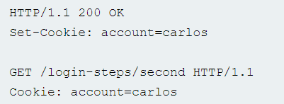

# Cross-site scripting

Межсайтовый скриптинг (также известный как XSS) — это уязвимость веб-безопасности, которая позволяет злоумышленнику скомпрометировать взаимодействие пользователей с уязвимым приложением. Это позволяет злоумышленнику обойти одну и ту же политику происхождения, которая предназначена для отделения разных веб-сайтов друг от друга. Уязвимости межсайтового скриптинга обычно позволяют злоумышленнику маскироваться под пользователя-жертву, выполнять любые действия, которые может выполнять пользователь, и получать доступ к любым данным пользователя. Если пользователь-жертва имеет привилегированный доступ к приложению, злоумышленник может получить полный контроль над всеми функциями и данными приложения.&#x20;

Межсайтовые сценарии работают, манипулируя уязвимым веб-сайтом, чтобы он возвращал пользователям вредоносный код JavaScript. Когда вредоносный код выполняется в браузере жертвы, злоумышленник может полностью скомпрометировать свое взаимодействие с приложением.

<figure><figcaption></figcaption></figure>

Вы можете подтвердить большинство видов уязвимостей XSS, внедрив полезную нагрузку, которая заставляет ваш браузер выполнять произвольный код JavaScript. Давно стало обычной практикой использовать для этой цели функцию alert() (print() в Google Chrome), потому что она короткая, безвредная и ее довольно сложно не заметить при успешном вызове.

Существует три основных типа XSS-атак:

*   ### Reflected cross-site scripting 

    Reflected XSS — простейшая разновидность межсайтового скриптинга. Она возникает, когда приложение получает данные в HTTP-запросе и включает эти данные в немедленный ответ небезопасным способом. Вот простой пример отраженной XSS-уязвимости:

<figure><figcaption></figcaption></figure>

Приложение не выполняет никакой другой обработки данных, поэтому злоумышленник может легко построить атаку следующим образом:

<figure><figcaption></figcaption></figure>

Если пользователь посещает URL-адрес, созданный злоумышленником, сценарий злоумышленника выполняется в браузере пользователя в контексте сеанса этого пользователя с приложением. В этот момент скрипт может выполнять любые действия и извлекать любые данные, к которым у пользователя есть доступ.

*   ### Stored cross-site scripting 

    Сохраненный XSS (также известный как постоянный или XSS второго порядка) возникает, когда приложение получает данные из ненадежного источника и включает эти данные в свои более поздние HTTP-ответы небезопасным способом. Рассматриваемые данные могут быть отправлены в приложение через HTTP-запросы; например, комментарии к сообщению в блоге, псевдонимы пользователей в чате или контактные данные в заказе клиента. В других случаях данные могут поступать из других ненадежных источников; например, приложение веб-почты, отображающее сообщения, полученные по SMTP, маркетинговое приложение, отображающее сообщения в социальных сетях, или приложение для мониторинга сети, отображающее пакетные данные из сетевого трафика. Вот простой пример сохраненной XSS-уязвимости. Приложение доски объявлений позволяет пользователям отправлять сообщения, которые отображаются для других пользователей:

<figure><figcaption></figcaption></figure>

Приложение не выполняет никакой другой обработки данных, поэтому злоумышленник может легко отправить сообщение, которое атакует других пользователей:

<figure><figcaption></figcaption></figure>

*   ### DOM-based cross-site scripting 

    XSS на основе DOM (также известный как DOM XSS) возникает, когда приложение содержит некоторый клиентский JavaScript, который обрабатывает данные из ненадежного источника небезопасным способом, обычно путем записи данных обратно в DOM. В следующем примере приложение использует JavaScript для чтения значения из поля ввода и записи этого значения в элемент в HTML:

<figure><figcaption></figcaption></figure>

Если злоумышленник может контролировать значение поля ввода, он может легко создать вредоносное значение, которое приведет к выполнению его собственного сценария:

<figure><figcaption></figcaption></figure>

В типичном случае поле ввода заполняется частью HTTP-запроса, например параметром строки запроса URL-адреса, что позволяет злоумышленнику осуществить атаку с использованием вредоносного URL-адреса таким же образом, как отраженный XSS.

### Для чего можно использовать XSS? 

* Выдавать себя за пользователя-жертву или маскироваться под него
* Выполнить любое действие, которое может выполнить пользователь
* Читать любые данные, к которым пользователь может получить доступ
* Захват учетных данных пользователя

### Влияние XSS-уязвимостей 

Фактическое воздействие XSS-атаки обычно зависит от характера приложения, его функций и данных, а также от статуса скомпрометированного пользователя, например:

* В брошюрном приложении, где все пользователи анонимны, а вся информация общедоступна, воздействие часто будет минимальным
* В приложении, хранящем конфиденциальные данные, такие как банковские транзакции, электронные письма или медицинские записи, воздействие обычно будет серьезным
* Если скомпрометированный пользователь имеет повышенные привилегии в приложении, то воздействие, как правило, будет критическим, позволяя злоумышленнику получить полный контроль над уязвимым приложением и скомпрометировать всех пользователей и их данные

### Как найти и протестировать XSS-уязвимости 

Подавляющее большинство уязвимостей XSS можно найти с помощью  Burp Suite. Ручное тестирование отраженных и сохраненных XSS обычно включает отправку некоторого простого уникального ввода (например, короткой буквенно-цифровой строки) в каждую точку входа в приложении, идентификацию каждого места, где отправленный ввод возвращается в ответах HTTP, и тестирование каждого местоположения по отдельности, чтобы определить можно ли использовать правильно сформированный ввод для выполнения произвольного JavaScript. Таким образом, вы можете определить контекст, в котором происходит XSS, и выбрать подходящий пэйлоад для ее использования.&#x20;

Ручное тестирование XSS на основе DOM, возникающее из параметров URL, включает аналогичный процесс: помещение некоторого простого уникального ввода в параметр, использование инструментов разработчика браузера для поиска этого ввода в DOM и проверка каждого местоположения, чтобы определить, можно ли его использовать. Однако другие типы DOM XSS сложнее обнаружить.

### Как предотвратить XSS-атаки 

Предотвращение межсайтовых сценариев в некоторых случаях тривиально, но может быть намного сложнее в зависимости от сложности приложения и способов, которыми оно обрабатывает данные, контролируемые пользователем. В целом, эффективное предотвращение XSS-уязвимостей, вероятно, будет включать комбинацию следующих мер:&#x20;

* **Фильтрация входных данных** (В момент получения пользовательского ввода фильтруйте как можно более строго на основе ожидаемого или действительного ввода)
* **Кодирование данных на выходе** (В момент, когда управляемые пользователем данные выводятся в ответах HTTP, кодируйте выходные данные, чтобы предотвратить их интерпретацию как активное содержимое)
* **Использование соответствующих заголовков ответа** (Чтобы предотвратить XSS в ответах HTTP, которые не должны содержать какой-либо HTML или JavaScript, вы можете использовать заголовки Content-Type и X-Content-Type-Options, чтобы гарантировать, что браузеры интерпретируют ответы так, как вы задумали)
* **Политика безопасности контента** (В качестве последней линии защиты вы можете использовать политику безопасности контента (CSP), чтобы уменьшить серьезность любых уязвимостей XSS, которые все еще возникают)

**В чем разница между XSS и CSRF?**

XSS заставляет веб-сайт возвращать вредоносный код JavaScript, а CSRF побуждает пользователя-жертву выполнять действия, которые он не намеревался совершать.

**В чем разница между XSS и SQL-инъекцией?**

XSS — это уязвимость на стороне клиента, нацеленная на других пользователей приложения, а внедрение SQL — это уязвимость на стороне сервера, нацеленная на базу данных приложения.

**Как предотвратить XSS в PHP?**

Отфильтровать вводимые данные с помощью белого списка разрешенных символов. Экранировать выходные данные с помощью htmlentities и ENT\_QUOTES для контекстов HTML или экранирования JavaScript Unicode для контекстов JavaScript.

**Как предотвратить XSS в Java?** Отфильтровать входные данные с помощью белого списка разрешенных символов и использовать библиотеку, такую ​​как Google Guava, для HTML-кодирования выходных данных для контекстов HTML или использовать escape-последовательности JavaScript Unicode для контекстов JavaScript.
